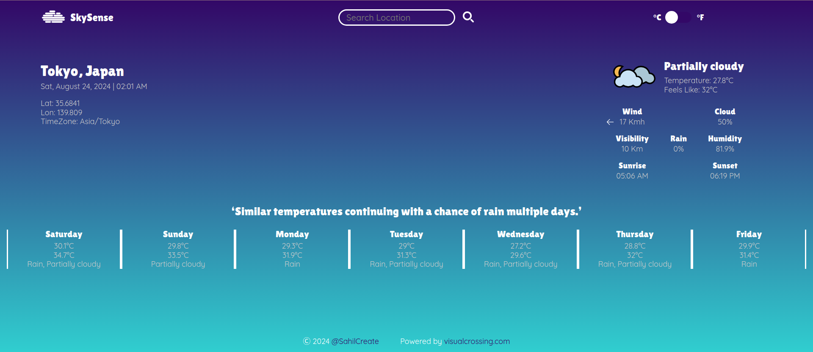

# Weather App

## Live Demo

[See the Weather App here!](https://sahilcreate.github.io/weather-app/)

## ABOUT THE PROJECT

Learning from [The Odin Project](https://www.theodinproject.com/lessons/node-path-javascript-weather-app) curriculum.

This project was mostly working with APIs and asynchronous code.

### Build With

#### Technologies

- Javascript
- CSS
- HTML

#### Third-party code

- date-fns
- Google gonts

#### Tools

- Visual Studio Code
- Git and GitHub
- Webpack
- HTMLWebpackPlugin

## OBJECTIVES

- [x] display weather using VisualCrossing API
- [x] can toggle Celcius and Fahrenheit
- [x] change look based on data (icons)
  - [x] i used the svgs provided on visual crossing github
- [x] use Promises or Asyn/Await in the code
- [x] add a form that lets users input the location
- [x] handle errors

## LESSON LEARNED

I was using the Divide and Conquer with other projects too, but project, although small, gave me better clarity on it.  
I also thought about adding backgroud gifs depending on the weather but i think that wouldn't have really helped me with learning new things. Let's save it for future.  
Working with APIs was fun. It is a whole new world of possibilities that i can't wait to explore.

## SCOPE CREEP

- [ ] Add responsiveness
- [ ] Add accessibility
- [ ] Add backgroud gifs according to weather
- [ ] Add icons for weekly forecast
- [ ] Add hourly forecast
- [ ] Handle the Celcius and Fahrenheit fetch better
- [ ] Add better error handling

## ACKNOWLEDGMENTS

- [The Odin Project](https://www.theodinproject.com/)
- [CSS Tricks](https://css-tricks.com/)
- [GoogleFonts for QuickSand and Lilita One](https://fonts.google.com/cs)
- [Visual Crossing API](https://www.visualcrossing.com/weather-api)
- [Meyer's Reset](https://meyerweb.com/eric/tools/css/reset/)
- [date-fns](https://date-fns.org/)
